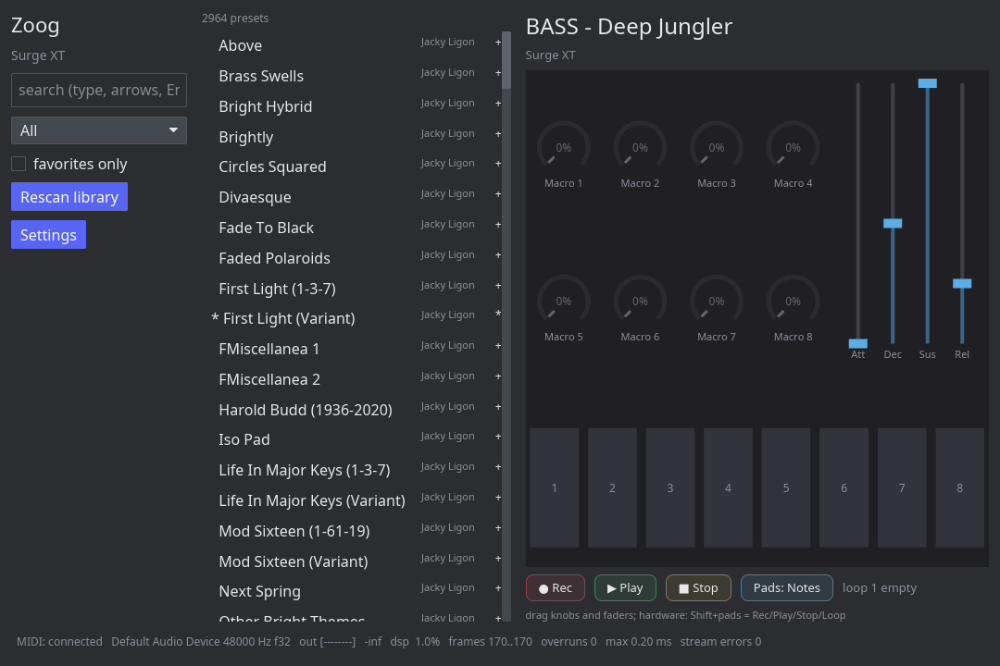

<div align="center">


# Zoog

**A native Linux sound browser, macro controller, and MIDI phrase looper
for the Arturia MiniLab 3.**

[](https://github.com/cwhite911/zoog/actions/workflows/ci.yml)
[](https://cwhite911.github.io/zoog/)
[](https://github.com/cwhite911/zoog/releases)
[](LICENSE)
[](#building)

</div>

Zoog hosts CLAP instruments and gives the MiniLab 3 the workflow its bundled
software offers elsewhere: browse a searchable preset library from the hardware
or the screen, play with low latency, and shape the sound with the eight
encoders and four faders while the device display follows along.

<div align="center">

</div>

## Features

- **Preset browsing from the hardware.** The main encoder scrolls the filtered
  library, Shift changes category, click loads, all with display feedback.
- **Per-engine macro mappings** with value-scaling soft takeover, so values
  never jump, plus live macro names read from the loaded patch.
- **A MIDI phrase looper** on the transport pads: arm, play, and the loop closes
  and cycles on the next press. Overdub layers on top.
- **Eight loop slots on the pads**, each keeping the preset it was recorded
  with, mixed live from its own engine instance.
- **Survives the real world.** Controller hotplug and audio stream loss both
  recover on their own; the status bar carries an output meter, DSP load, and
  callback health.

Surge XT and Odin2 work out of the box. Other CLAP instruments appear
automatically; a mapping file makes their knobs live.

**Not affiliated with or endorsed by Arturia.** Device communication is based on
community-documented MIDI and SysEx behavior, recorded from hardware captures in
[`docs/`](docs/minilab3-control-map.md).

## Documentation

The [**user manual**](https://cwhite911.github.io/zoog/) covers installation,
the interface, browsing, macros, the looper and loop slots, adding engines, and
troubleshooting.

Reference: [control map](docs/minilab3-control-map.md) ·
[SysEx messages](docs/minilab3-sysex.md) ·
[capture procedure](docs/capture-script.md)

## Install

### apt (Debian, Ubuntu, Pop!_OS)

```bash
curl -fsSL https://cwhite911.github.io/zoog/apt/zoog-archive-keyring.asc \
  | sudo gpg --dearmor -o /usr/share/keyrings/zoog-archive-keyring.gpg
echo "deb [signed-by=/usr/share/keyrings/zoog-archive-keyring.gpg] https://cwhite911.github.io/zoog/apt stable main" \
  | sudo tee /etc/apt/sources.list.d/zoog.list
sudo apt update && sudo apt install zoog
```

Updates then arrive with the rest of your system updates. You also need a CLAP
instrument to play, for example `sudo apt install surge-xt`.

Or grab the `.deb` straight from the
[latest release](https://github.com/cwhite911/zoog/releases/latest).

## Building

```bash
./scripts/check-env.sh      # toolchain, ALSA, Vulkan, a CLAP synth
cargo build --release
./target/release/zoog
```

`scripts/build-deb.sh` produces a Debian package (needs `cargo-deb`). CI runs
`cargo fmt --check`, `cargo clippy -D warnings`, and the full test suite on
every push.

Binaries: `zoog` (the application) and `labctl` (debug CLI: MIDI monitoring and
captures, device display and pad SysEx, plugin and parameter inspection, the
preset library, and a headless play mode).

## Workspace

| Crate | Purpose |
|---|---|
| `lab-midi` | Device discovery, MIDI event decoding, SysEx encoding, `Device` trait + mock |
| `lab-engine` | CLAP hosting, real-time audio, preset discovery, multi-instance mixing |
| `lab-library` | SQLite preset index: categories, favorites, search |
| `lab-core` | Application core: engine orchestration, macro mapping, phrase looper |
| `lab-gui` | iced application (the `zoog` binary) |
| `labctl` | Debug and development CLI |

Tests run without hardware and without a plugin: device behavior is replayed
from recorded captures, and engine tests skip cleanly when no CLAP instrument is
installed.

## License

GPL-3.0-only. See [LICENSE](LICENSE).
